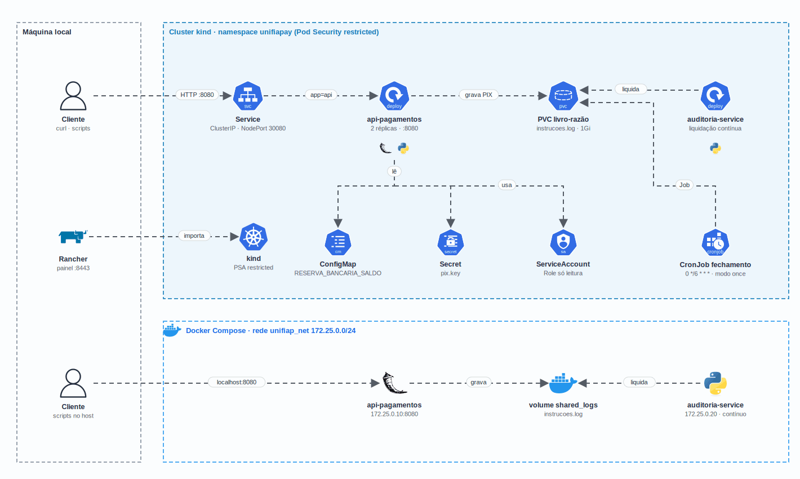

<h1 align="center">
  GS2 - UniFIAP Pay SPB no Docker e no Kubernetes
</h1>

<p align="center">
  <a href="https://skillicons.dev">
    
  </a>
</p>

## Qual a finalidade do projeto?

Global Solution 2 da disciplina de **Kubernetes** (FIAP, novembro de 2025). O desafio simula um PIX dentro do **Sistema de Pagamentos Brasileiro (SPB)** com dois microsserviços em Flask/Python:

- **api-pagamentos**, o banco originador (UniFIAP Pay): só aceita o PIX se houver **reserva bancária** suficiente no BACEN e registra a instrução no **livro-razão** com o status `AGUARDANDO_LIQUIDACAO`;
- **auditoria-service**, o sistema de liquidação (BACEN/STR): lê o livro-razão e muda as instruções pendentes para `LIQUIDADO`, rodando também como **CronJob** a cada 6 horas.

O livro-razão é um arquivo (`instrucoes.log`) em um **volume compartilhado**: volume Docker no Compose e **PVC** no Kubernetes. A entrega cobre quatro etapas: imagem segura, rede segmentada, deploy e escala no Kubernetes, e segurança (securityContext, Pod Security e RBAC).

## Arquitetura

<p align="center">
  
</p>

## O que foi construído

### Microsserviços

| Serviço | Papel no SPB | O que faz |
|---|---|---|
| `api-pagamentos` | Banco originador | `POST /api/v1/pix` valida `valor <= reserva disponível` e grava a instrução no livro-razão |
| `auditoria-service` | BACEN / STR | Liquida as instruções `AGUARDANDO_LIQUIDACAO`; modo `continuous` (loop) ou `once` (CronJob) |

### Rotas da API

| Rota | O que faz |
|---|---|
| `GET /health` | Saúde e saldo da reserva (usado nas probes) |
| `POST /api/v1/pix` | `{ "valor": 100.5, "chave_destino": "...", "descricao": "..." }`: 201 aprovado, 400 inválido ou `REJEITADO` |
| `GET /api/v1/reserva` | Saldo (inicial menos liquidados), valor comprometido com PIX pendentes e disponível para novos PIX |

### Kubernetes (`k8s/`)

| Manifesto | Objeto | Destaque |
|---|---|---|
| `01-namespace.yaml` | Namespace `unifiapay` | Pod Security Admission em `restricted` |
| `02-configmap.yaml` | ConfigMap | `RESERVA_BANCARIA_SALDO`, porta, caminho do livro-razão |
| `03-secret.example.yaml` | Secret (exemplo) | Referência; o Secret real é criado no deploy a partir do `docker/pix.key` |
| `04-pvc.yaml` | PVC `unifiapay-logs-pvc` | Livro-razão compartilhado (1 Gi, StorageClass `standard` do kind) |
| `05-deployment-api.yaml` | Deployment | 2 réplicas, probes, requests/limits, não root, capabilities removidas |
| `06-deployment-auditoria.yaml` | Deployment | 1 réplica em modo contínuo |
| `07-service-api.yaml` | Services | ClusterIP `:8080` e NodePort `30080` |
| `08-cronjob-fechamento.yaml` | CronJob | `0 */6 * * *`, modo `once` |
| `09` a `11` | ServiceAccount, Role e RoleBinding | `get/list/watch` em pods e logs, `get/list` em configmaps e PVCs, só `get` em secrets; nada de criar ou apagar |
| `exemplos/pod-inseguro.yaml` | Pod | Root, privilegiado e com hostPath: prova que o namespace recusa |

### Correções feitas na revisão

| Problema encontrado nos testes | Correção |
|---|---|
| Healthcheck do compose usava `curl`, que não existe na imagem `python:slim`: container sempre `unhealthy` | Healthcheck com Python |
| Auditoria no compose rodava em modo `once` com `restart: unless-stopped`: reiniciava sem parar | Modo `continuous` no compose |
| Deployments e CronJob usavam `hostPath` e ignoravam o PVC criado | Todos montam o `unifiapay-logs-pvc` |
| `deploy-k8s.sh` esperava o PVC ficar `Bound` antes dos Pods; no kind (`WaitForFirstConsumer`) o deploy travava | Espera depois dos Deployments |
| API e auditoria mexiam no livro-razão ao mesmo tempo: um PIX gravado durante a liquidação podia sumir | Trava de arquivo (`flock`) nas duas pontas |
| PIX pendentes não contavam na reserva: vários PIX seguidos passavam do saldo | A validação desconta o valor comprometido |
| Scripts de teste com ping/curl dentro dos containers, campo de saldo errado e `docker compose run` com IP fixo em conflito | Scripts corrigidos e retornando erro quando algo falha |
| `requests 2.31` com CVEs e dependências sem uso | Flask 3.1.3; `requests` e `python-dotenv` removidos |
| Chave PIX versionada, senha fixa do Rancher na documentação e usuário do Docker Hub fixo | `.env.example`, `pix.key.example`, Secret criado no deploy, `RANCHER_BOOTSTRAP_PASSWORD` e `DOCKERHUB_USER` por variável |

## Tecnologias utilizadas

- **Python 3.11 + Flask 3.1:** API de pagamentos e serviço de liquidação;
- **Docker (multi-stage) e Docker Compose:** imagens com usuário não root e rede `unifiap_net` em `172.25.0.0/24`;
- **Kubernetes no kind:** Deployments, Service, PVC, CronJob, ConfigMap, Secret, RBAC e Pod Security Admission;
- **Rancher:** painel para acompanhar o namespace (guia em [docs/RANCHER.md](docs/RANCHER.md));
- **pytest:** testes da regra da reserva, da liquidação e da concorrência no livro-razão;
- **Trivy e kubeconform:** varredura das imagens e validação dos manifestos;
- **GitHub Actions:** testes, compose e kind a cada push e pull request, sem credenciais.

## Estrutura do repositório

```text
fiap-k8s-gs2/
├── api-pagamentos/          # Flask: /health, /api/v1/pix, /api/v1/reserva
│   ├── src/services/        # Regra da reserva bancária
│   ├── src/utils/           # Logger e trava do livro-razão
│   └── tests/
├── auditoria-service/       # Liquidação (modo contínuo ou once)
│   ├── src/services/
│   └── tests/
├── docker/
│   ├── docker-compose.yml   # Rede unifiap_net + volume shared_logs
│   ├── .env.example
│   └── pix.key.example
├── k8s/                     # Manifestos 01 a 11 + exemplos/pod-inseguro.yaml
├── scripts/                 # Build, deploy, testes e Rancher
├── evidencias/              # Saídas reais das etapas 1 a 4
├── docs/                    # Diagrama e guia do Rancher
└── .github/workflows/ci.yml
```

## Fluxo de funcionamento

1. O cliente envia `POST /api/v1/pix` para o Service (ou para `localhost:8080` no compose).
2. A `api-pagamentos` segura a trava do livro-razão, soma o que já foi liquidado e o que está pendente e compara com `RESERVA_BANCARIA_SALDO`.
3. Se houver reserva, grava a instrução com `AGUARDANDO_LIQUIDACAO` no `instrucoes.log`; se não, responde `400` com `REJEITADO`.
4. A `auditoria-service` (em loop) ou o Job do `cronjob-fechamento-reserva` pega a trava exclusiva, muda as pendentes para `LIQUIDADO` e registra cada uma em `liquidacoes.log`.
5. A partir daí o saldo da reserva em `GET /api/v1/reserva` cai pelo valor liquidado.

## Como rodar

### Docker Compose

```bash
./scripts/preparar-ambiente.sh          # cria docker/.env e um docker/pix.key aleatório
cd docker && docker compose up -d --build --wait
curl http://localhost:8080/health
```

Para apagar: `docker compose down -v` dentro de `docker/`.

### Kubernetes no kind

```bash
kind create cluster --name unifiapay
KIND_CLUSTER=unifiapay ./scripts/build-images.sh   # build v1.556336 e carga no kind
./scripts/deploy-k8s.sh                             # cria o Secret e aplica os manifestos
kubectl -n unifiapay port-forward svc/api-pagamentos-service 8080:8080
```

Para publicar no Docker Hub: `DOCKERHUB_USER=<usuario> ./scripts/build-images.sh` e depois `DOCKERHUB_USER=<usuario> ./scripts/push-images.sh` (com `docker login`); nesse caso troque a imagem nos manifestos por `<usuario>/<imagem>:v1.556336`.

Para apagar: `kind delete cluster --name unifiapay`.

## Como validar a entrega

| Etapa | Comando | O que confere |
|---|---|---|
| Testes | `cd api-pagamentos && python -m pytest` (idem em `auditoria-service`) | 16 testes: validação, reserva comprometida, liquidação e concorrência |
| 1. Imagem | `docker build` com saída em `evidencias/etapa1-docker/` | Build multi-stage; Trivy com **0 críticas** (as altas são do Debian e do pip da imagem base) |
| 2. Rede | `./scripts/testar-comunicacao.sh` | `unifiap_net` em `172.25.0.0/24`, API em `.10`, auditoria em `.20`, HTTP entre os containers |
| 2. Fluxo | `./scripts/simular-pix.sh` e `./scripts/teste-fluxo-completo.sh` | PIX aprovado, PIX acima da reserva recusado, saldo cai só depois da liquidação |
| 3. Kubernetes | `./scripts/teste-k8s.sh` (com `EVIDENCIAS=1` grava as saídas) | Mesmo livro-razão nos Pods da API, Job do CronJob liquidando, saldo e escala para 3 réplicas |
| 4. Segurança | `./scripts/testar-seguranca.sh` | Pod inseguro recusado pelo Pod Security, securityContext aplicado e `auth can-i` da ServiceAccount |

As saídas de uma execução real, feita em setembro de 2026 na revisão do projeto, estão em [`evidencias/`](evidencias). Não fazem parte delas: o `docker push` (depende de conta no Docker Hub), o `kubectl top` (o kind não traz o metrics-server) e as telas do Rancher (o guia não foi reexecutado na revisão).

## Autor

**William Coelho** · RM 556336 · [@willtechdev](https://github.com/willtechdev)
